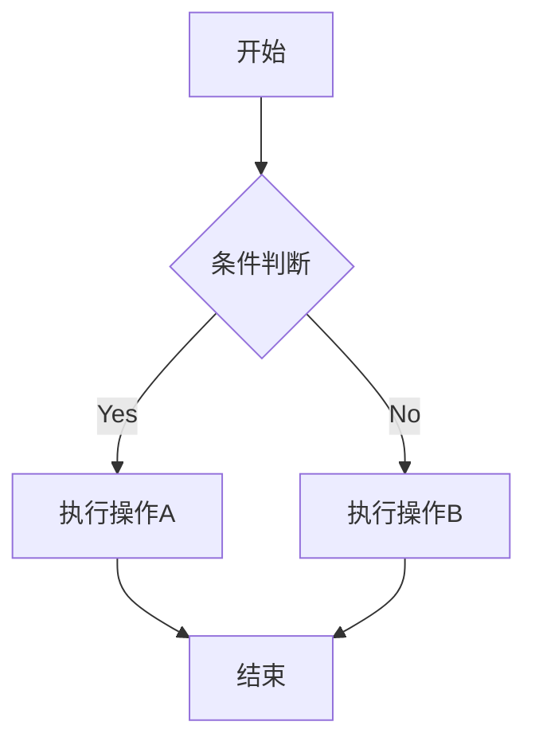

# mall
  
## 项目框架  
- 项目主体框架：SpringBoot + Spring Cloud + Spring Cloud Alibaba
- 数据库：Mysql
- 注册中心：Nacos
- 配置中心：Nacos
- 网关：Spring Cloud Gateway
  * 安全框架： Spring Security
  * 第二项
  * 第三项


## 项目模块
- 后台模块   admin
- 公共模块   common
- 优惠卷模块  coupon
- 网关模块   gateway
- 代码生成模块 generator
- 用户模块   member
- 订单模块   order
- 产品模块   product
- 库存模块   ware


# 整体框架
```
客户端 → Spring Cloud Gateway（安全拦截） → 微服务（业务逻辑）
        │  
        ├─ 认证（JWT/OAuth2）  
        ├─ 授权（角色/权限校验）  
        └─ 路由过滤
```

